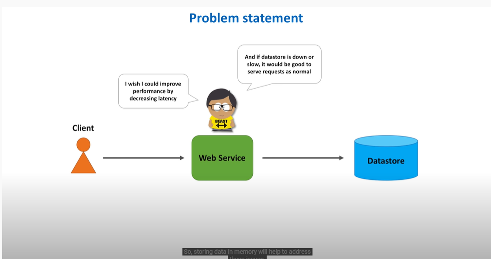
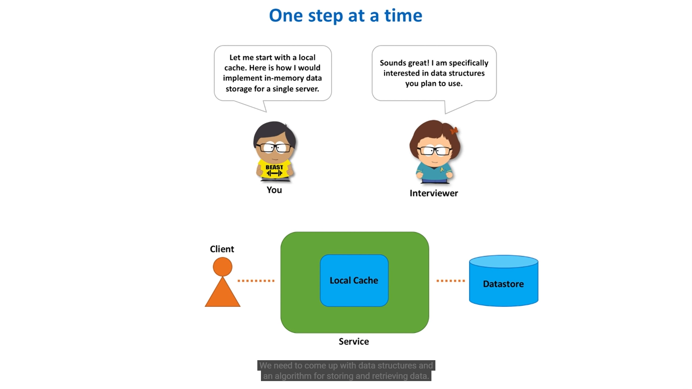
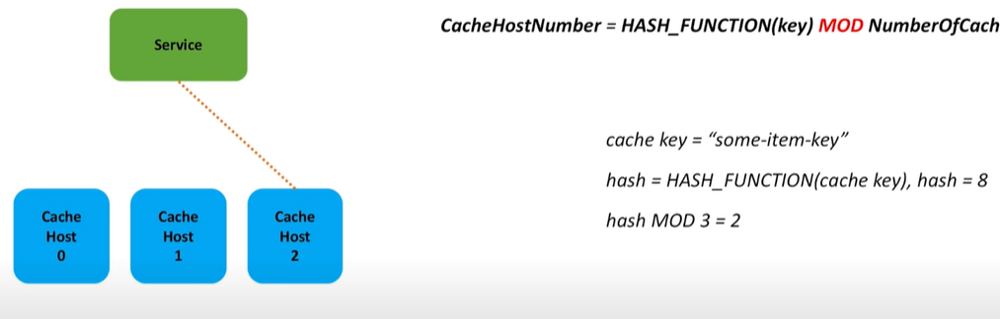
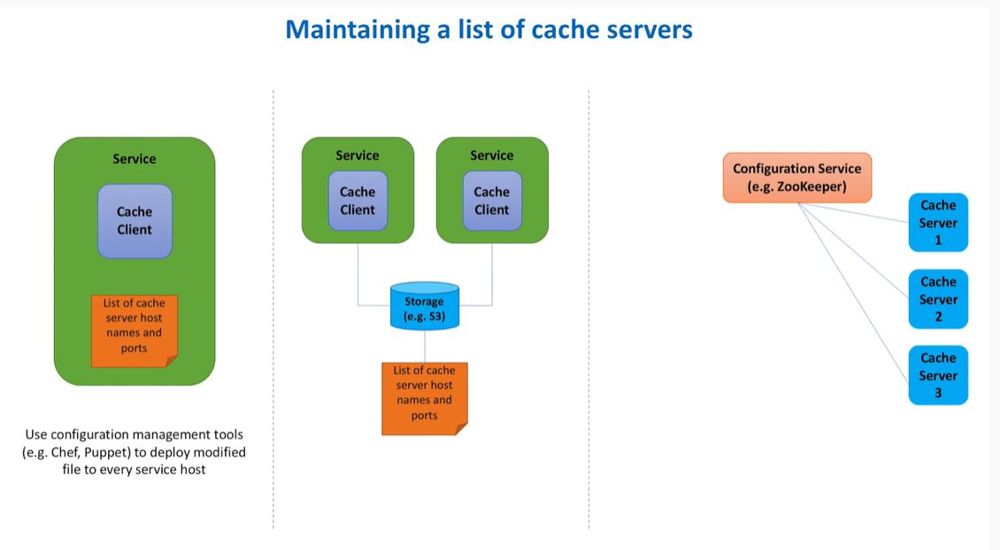
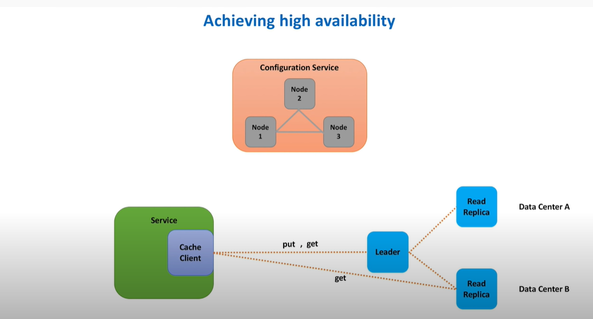
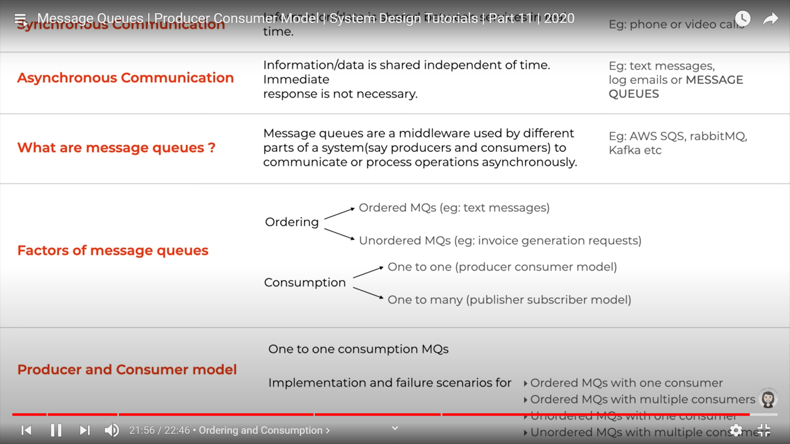
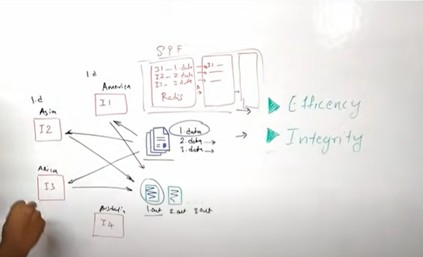
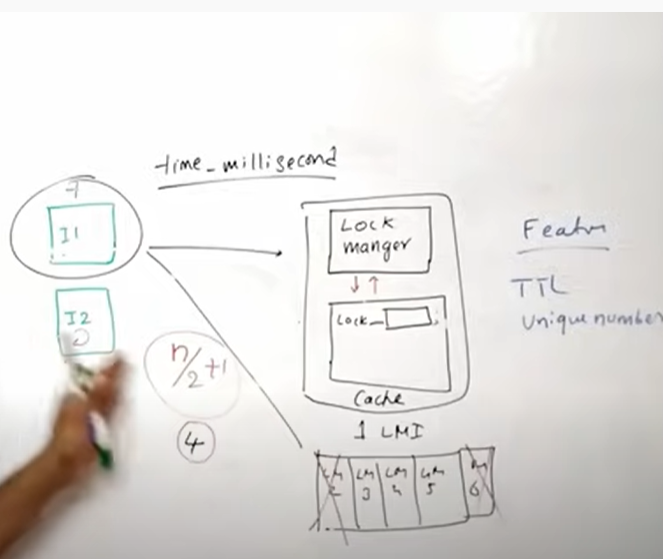

## Fundmentals of system design

## System Design Components
- Logical Entities  
  - Data Storing system - (Database)
  - Presentation
- Tangible Entities
  - Technologies used to achieve the points discussed above

- PIC : TODO

## Client Server Architecture
  - Thick Clients: Client contains heavy logics in it. Example: Gameing app, Video Editing client, etc.
  - Thin Clients: Client contains less business logic  Example: web client talking to the server to ftech data 
  
## Proxy
  - **Forward proxy** 
    - Usecase 
      - caching data
      - securing server from clients 
      - forward traffic
      - blocking some website inside organization
        - Types 
          - **Half proxy**: The proxy server just forward the same connection request from the client to the server. The server responds back to the client directly, not via any proxy in between. 
          - **Full proxy**: The proxy server terminates the connection request and create  a new connection for every request to the server. The same technique is applied while responding back to the client.

  - **Big IP**: This s a type of full proxy where the filtering of packets could be done at the network layer.
  - **Reverse proxy**: This is a type of full proxy where filtering of packets could be done at the network layer as well as the application layer(L7).
    - Proxy server routes the traffic to different servers based on some rules. This could be multiple instance of the same server. So, client is not aware of how the servers are set up
    - It can be used in
      - securty
        - rate limiting
        - DDos Attack 
      - caching the request
      - ssl termination
      - improving security
      - can act as a load balancer
      - can act as an ingress
      - canary deployment
      - Compressing the request
      - Example: API gateway
  - Must watch
    - What is a Proxy?: https://www.youtube.com/watch?v=jGQTS1CxZTE
    - Proxy vs. Reverse Proxy (Explained by Example): https://www.youtube.com/watch?v=ozhe__GdWC8
      - https://www.youtube.com/watch?v=AuINJdBPf8I
    - Service mesh as the reverse proxy: https://www.youtube.com/watch?v=QiXK0B9FhO0
    - https://www.youtube.com/watch?v=MiqrArNSxSM
  - Sock proxy
  - Http Proxy
  - Transparent Proxt

- Canary deployment vs rolling dployment

## Data Flow and Data system
- Data flow
- Presentation layer (text/audio/video etc.) -> Application layer (json/xml etc) -> Database layer (table/collection etc.)
- Factors to be taken care of 
  - Data types system is working on
  - Data storage
  - Type of system: whether the sytem needs to store a huge amount of data frequently or retrieve data very often. (e.g. streaming system, transaction system)

## Caching

### Important points to consider while choosing any cache
1. Features & Specs
2. Cache Access Pattern
3. Cache Eviction
4. Scalability

### Caching patterns 
- 

### Cache replacement or cache eviction
- Least recently used
- Least frequently used
- Combination of both 

### Cache invalidation
  - TTL is used to mark invalidate the data in a cache after the expiration period.

### Distributed Cache
Q: Design a distributed cache
Ans:  
  - `Functional requirement`:
    - get item
    - put item
  - `Non functional requirement`
    - highly scalable
    - high performance
    - high availability

Design 
Background: 
Why do we need a cache?

Simple: Step 1: 
The application service contains the cache in memory
In memory cache

Cache Eviction strategy
Least recently used algorithm

Data structure to implement hash
- Hash map to keep the mapping
- Double linked list to keep the nodes with values and maintain priority in terms of its usage

#### Simple: Step 2:
Moving towards distributed world.

Step 1: Keep the cache cluster as a seperate process inside the machine application service is running. This is called co-located cache cluster.

Step 2: Split the cache into multiple shards to handle more request and improve the speed.

Disadvantage with this approach
- Optimizing the hardware not possible as we need to keep the cache in memory so it must be memory intensive.
-  Cache is scaled along with the application server.

Improvement: 

- Run the cache cluster in a seperate machine or hardware setup.
- It also allows other services to use the cache

#### Simple: Step 3

Q. How the cache client decides which shard to choose?

A. If we use key based hashing to find the shard, then we will map the every request to a shard based on some hash function. Adding or removing a shard will require moving data from one shard to another shard.

Improvement:
Use consistent hashing

Q. Where the mapping of sharding will be maintained? or who will maintain that?

**Option 1**. Each application service will use a cache client to communicate to the cache shard. Now each client can maintain the mapping somewhere in a configuration file.

We can use configuration tool (e.g. chef) to deploy the latest change of the configuration file  to the application server when a new shard is added or some shard is deleted.

**Option 2**. There could be a configuration service (e.g. zookeeper) which will maintain the list. Each cache shard server will need to send heartbeat request to the configuration service to register itself in every certain interval.

High Performance?
A: yes, 
  1. Cache client communicate with cache shard via TCP or UDP
  2. Data are splitted into multiple shards to handle more request

High Availability?
A. No,
  1. In case one shard fails, it will increase load to the next shard as all the load handled by that shard will fall back to the nearest shard as per consistent hashing technique. We need to find some way to scale the shard or have multiple replications.

#### Simple: Step 4
We can follow master slave architecture to have multiple replications of every single shard.
 
Each shard will have a leader which will handle all the write request and will have multiple read replicas or slaves. If the leader fails, any of the slave becomes the new leader. 

**Now, who will do this monitoring?**

A `Configuration service` like zookeeper will do this task. 

**How the replication will happen?**
Data replication will be handled asynchronously. To handle consistency issue, we need to use synchronous replication.

**Cache eviction**
- LRU Cache replaceement
- Set up data expiry and have a batch job to remove the expired data from the cache.

#### Securing cache
 - Encryption and decryption before storing or retrieving data from cache
 - Put cache behind a firewall to allow traffic from the authenticated server or client
 - Never put cache in the public subnet

#### Caching topologies
- Single in memory caching topology
- Distributed caching 
- Replicated caching
- Near cache hybrid 
  - Each application service will have a private cache in memory. The objective of a Near Cache is to provide the best of both worlds between the extreme performance of the Replicated Cache Service and the extreme scalability of the Partitioned Cache Service by providing fast read access to Most Recently Used (MRU) and Most Frequently Used (MFU) data. To achieve this, the Near Cache is an implementation that wraps two caches: a "front cache" and a "back cache" that automatically and transparently communicate with each other by using a read-through/write-through approach.

  - The "front cache" provides local cache access. It is assumed to be inexpensive, in that it is fast, and is limited in terms of size. The "back cache" can be a centralized or multi-tiered cache that can load-on-demand in case of local cache misses. The "back cache" is assumed to be complete and correct in that it has much higher capacity, but more expensive in terms of access speed. The use of a Near Cache is not confined to Coherence*Extend; it also works with TCMP.
  - https://docs.oracle.com/cd/E14526_01/coh.350/e14510/nearcache.htm#COHGS227

## Message Queues 
- A message queue is a form of asynchronous service-to-service communication used in serverless and microservices architectures. Messages are stored on the queue until they are processed and deleted. Each message is processed only once, by a single consumer.
- Foundation: Synchronous vs asynchronous
- 

- Many producers and consumers can use the queue, but each message is processed only once, by a single consumer. For this reason, this messaging pattern is often called one-to-one, or point-to-point, communications. When a message needs to be processed by more than one consumer, message queues can be combined with Pub/Sub messaging in a fanout design pattern.

- Must watch
  - https://youtu.be/FMhbR_kQeHw
  - https://aws.amazon.com/message-queue/
  - https://aws.amazon.com/blogs/aws/aws-lambda-adds-amazon-simple-queue-service-to-supported-event-sources/
    - sqs
      - dead letter queue to handle un-processed data
      - server side encryption
      - long polling to support destination failure
      - easy monitoring and cloud watch notification

## Pub/Sub
- diff b/w pub/sub and observable design pattern -  https://medium.com/easyread/difference-between-pub-sub-pattern-and-observable-pattern-d5ae3d81e6ce
- comparing-publish-subscribe-messaging-and-message - https://dzone.com/articles/comparing-publish-subscribe-messaging-and-message
- Example: `aws sns`
- fully managed and durable with automated scaling : message will never be lost
- topics and subscription based
- youtube.com/watch?v=LkmWLl35VjU&list=PL9nWRykSBSFg-CziAHKjr0XnvghEVkpFi&index=2
- youtube.com/watch?v=mXk0MNjlO7A
- Fault talarant mechanism in distributed system

# Apprach to system design
- Finalize the function and non-functional requirement
- Design the high level component diagram
- Talk about connecting multiple componenets by designing APIS
- Specify why you have choosen this design by mentioning drawback of other approaches
- Database and caching design to meet the non functional requirement
- Talk about the critical part of the application
- How to improve performance of the system as well as the customer 
- Monitoring & Operation - logging, metrics, auditing, making system more reliable, single point of failure, load balancer, etc..

## Design Twitter
Functional requirement
- Twitting 
- Timeline
  - User profile specific timeline
  - Home page timeline
- Following

Non functional requirement
- Highly Available
- Highly scalable
- Durability
- High Performant

## Design Message Queue

### Functional requirement
- send message
- receive message
- Pull vs Push 
- Message ordering (FIFO)

### Non functional requirement
- Scalable (Must be able to handle large no of request )
- Avaialble (Must be able to handle hardware/network failure to meet the request)
- Durability (Message submitted should not get lost before the consumer can consume it)
- High performant
- Avoid Message duplication and processing of same message by multiple consumer
- Message delivery sematics (Handleing undelivered message) (at most once, at least once, exactly once),
- Monitoring and security

#### Meta data service management
1. Distributed cache cluster consists of multiple host with same data replicated among all the nodes
2. The cache is splitted into multiple shards and stored in each node inside the cluster. Now, each shard can have multiple replicas with ledaer and follower pattern. There could be a configuration service like zookeeper to handle each shard cluster. Client (front end service) needs to decide which shards to connect to. 
3.  The cache is splitted into multiple shards and stored in each node inside the cluster. Once receiving any request host node will forward the request to appropriate shards. 

#### Back end service management
1. **Back end service single cluster with multiple nodes**
   1. Following leader follower pattern for each queue.
   2. replication between leader and followers could be in asynchronous or sync way.Sync replication ensures durability of the message at a cost of latency.
   3. There is a need of cluster configuration manager to monitor the health of cluster and keeping track of which queue is handled by which nodes. e.g. zookeeper
2. **Back end service with multiple clusters with multiple nodes**
   1. Each cluster handle different sets of queues.
   2. Each queue could be further partitioned and shared acorss multiple clusters. 
   3. Each nodes in a cluster will have the exactly same data replicated.

#### Front end service

watch - https://www.youtube.com/watch?v=iJLL-KPqBpM

## Rate Limit system design

## Distributed Locking

**Design Consideration**
- Data Integrity
- Efficieney 
- Avoid deadlock or indefinite waiting

### Approach 1

- Every instance or application do need to update the database or cache whenever they acquire/release any lock.

**Disadvantage**
  - The database must scale appropriately to maintain high availablity 
  - Multiple replicas are being synched asynchronously, it might lead to data inconsitency.

### Approach 2

- Every instance should communicate to the lock manager to acquire or release the lock. Lock Manager should add TTL while acquiring any lock request to avoid indefinite waiting or blocking. 
- Once the TTL period expires, the lock must be released.
- The Lock manager should also keep track which lock is being acquired using an unique ID. This will help the lock manager to release the appropriate lock when the release request is being made.
- The Lock manager may use timestamp as unique ID.
- To ensure the availabiliy of lock manager, there must be multiple instances of this. 
- When an application request for lock, it should take the locks by requesting atleast N/2+1 lock managers. 

### Data Replication Strategies

## Dustribited Logging 

### Functional requirements
1. Certalized log store
2. Centralized log tracing
3. Ability to generate report
4. Report specific to specific error
5. Altering based on error
6. Sending Notification 

### Non Functional requirement
1. Available
  