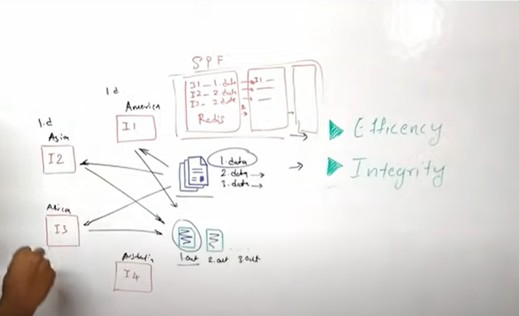
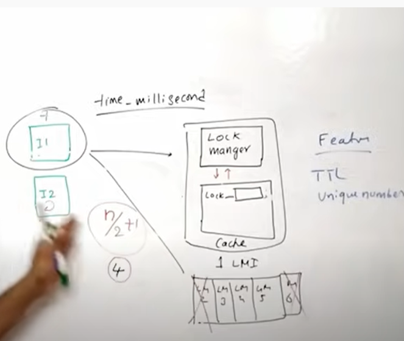

## Distributed Locking

**Design Consideration**
- Data Integrity
- Efficieney 
- Avoid deadlock or indefinite waiting

### Approach 1

- Every instance or application do need to update the database or cache whenever they acquire/release any lock.

**Disadvantage**
  - The database must scale appropriately to maintain high availablity 
  - Multiple replicas are being synched asynchronously, it might lead to data inconsitency.

### Approach 2

- Every instance should communicate to the lock manager to acquire or release the lock. Lock Manager should add TTL while acquiring any lock request to avoid indefinite waiting or blocking. 
- Once the TTL period expires, the lock must be released.
- The Lock manager should also keep track which lock is being acquired using an unique ID. This will help the lock manager to release the appropriate lock when the release request is being made.
- The Lock manager may use timestamp as unique ID.
- To ensure the availabiliy of lock manager, there must be multiple instances of this. 
- When an application request for lock, it should take the locks by requesting atleast N/2+1 lock managers. 

### Data Replication Strategies

